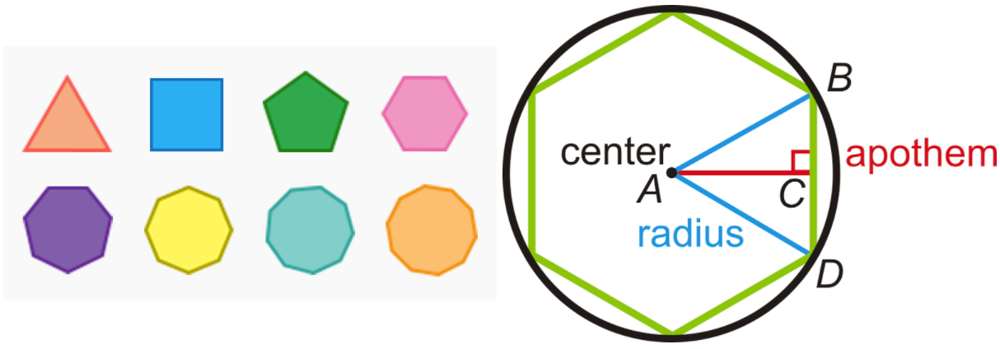

[](https://colab.research.google.com/drive/10FMS4C0Yi8hWqRwKYA7G8HrVG3INL7g1?usp=sharing)

[toc]

# Sequence Types

- A sequence type is a datatype which has a concept of **positional ordering** that is, we can access the element of the datatype by indexing
- In Python, indexing starts with 0 and not 1
- Following objects are  sequences in Python:
  - Mutable - `list` 
  - Immutable - `tuples`, `strings` and `range`
  - Other standard datatype: `namedtuple` and `deque` from collections package and array module 
- `set` is not a sequence type


## Homogeneous and Heterogeneous Sequences

- `Strings` and `range` are Homogeneous sequences that is they contain elements of same type
- `List` and `Tuple` are Heterogeneous sequences that is they can contain elements of different types 


## Iterable Type and Sequence Type

- An object is iterable if it is a `container` type of object and we can access its elements one by one
- Thus, any sequence type is iterable
- But not all iterables are sequence type. For example: `set`


## Standard Sequence Methods

All the mutable and immutable built-in sequences support the following methods:

### Presence State

- `element in sequence` and `element not in sequence`

### Repetition

- `sequence * 4`

### Concatenation

- Concatenation of two sequences `sequence1 + sequence2`

### Length

- `len(sequence)`

### Min and Max

- `min(sequence)` and `max(sequence)`

### Indexing

- `sequence.index(x)` - index of first occurrence of x in sequence
- `sequence.index(x, i)` - index of first occurrence of `x` in sequence at or after index `i`
- `sequence.index(x, i, j)` - index of first occurrence of `x` in sequence at or after index `i` and before index `j`

### Slicing

- `sequence[i]` - access element at index `i`
- `sequence[i:j]` - access elements from index `i` till before the index `j`
- `sequence[i: j: k]` - extended slice from index `i` till before index `j` in steps of `k`


> **Note: `range`** objects are more restrictive. They do have support concatenation and repetition 


## Hashing

Immutable sequence types may support hashing `hash(sequence)` but not if they contain mutable types


---


# Code Details

A regular strictly convex polygon is a polygon that has the following characteristics:

- all interior angles are less than 180
- all sides have equal length 

For a regular strictly convex polygon with:

- n edges (=n vertices)
- R circumradius
- interiorAngle=(n−2)⋅(180/n)
- edgeLength,s=2⋅R⋅sin(π/n)
- apothem,a=R⋅cos(π/n)
- area=(1/2)⋅n⋅s⋅a
- perimeter=n⋅s


## Objective-1

### Problem Statement

Create a Polygon Class:

- where initializer takes in:
  - number of edges/vertices
  -  circumradius

- that can provide these properties:
  - edges
  - vertices
  - interior angle
  - edge length
  - apothem
  - area
  - perimeter

- that has these functionalities:
  - a proper **__repr__** function
  - implements equality (==) based on # vertices and circumradius (**__eq__**)
  - implements > based on number of vertices only (**__gt__**)


### Solution

- In the `__init__` method, the inputs are checked for sanity. If invalid inputs are passed, then `ValueError` is raised
- In the `__getitem__` method  a string of property is expected. Since accessing properties with integers would be confusing and prone to error, string input is accepted by this method. Acceptable inputs - 'edges', 'vertices', 'interior_angle', 'edge_length', 'apothem', 'area', 'perimeter'
- In the `__repr__` method, the details of the object with number of vertices and circumradius is printed out
- In the `__eq__` method, two objects are compared based on number of edges of polygon and the radius of circle they are inscribed in
- In the `__gt__`method, two objects are compared based on the number of edges of the polygon

```python
# Standard Library Imports
import math
from operator import sub, mul, truediv
from functools import total_ordering


@total_ordering
class Polygon:
    """
    Class containing methods for a regular polygon
    """

    def __init__(self, edges, circumradius) -> None:
        """
        Constructor
        :param edges: number_of_edges of a circumscribed polygon
        :param circumradius: radius of a circle in which polygon is inscribed
        """
        if not isinstance(edges, int) or edges <= 2:
            raise ValueError(f"Enter valid input for number of edges. It cannot be less than 3. Current value: {edges}")
        elif not isinstance(circumradius, int) or circumradius < 1:
            raise ValueError(f"Enter valid input for number of circumradius. It cannot be less than or equal to 1. "
                             f"Current value: {circumradius}")
        else:
            self.edges = edges
            self.circumradius = circumradius

            # Dictionary to keep the record of data and return when asked
            self._data = dict()

            # Expected indexes for the __getitem__ method
            self._keys = ['edges', 'vertices', 'interior_angle', 'edge_length', 'apothem', 'area', 'perimeter']

    def __getitem__(self, _property: str) -> float:
        """
        Method to calculate and return the geometric properties
        :param _property: edges, vertices, interior_angle, edge_length, apothem, area, perimeter
        :return: value of the property
        """
        if _property in self._keys:
            self._data['edges'] = self.edges
            self._data['vertices'] = self.edges
            self._data['interior_angle'] = truediv(mul(sub(self.edges, 2), 180), self.edges)
            self._data['edge_length'] = mul(mul(2, self.circumradius), math.sin(truediv(math.pi, self.edges)))
            self._data['apothem'] = mul(self.circumradius, math.cos(truediv(math.pi, self.edges)))
            self._data['area'] = mul(mul(0.5, self.edges), mul(self._data['edge_length'], self._data['apothem']))
            self._data['perimeter'] = mul(self.edges, self._data['edge_length'])
            return self._data[_property]
        raise IndexError(f"Please check the entered index. Accepted index: {self._keys}")

    def __repr__(self) -> str:
        """
        Method returning a string representation of a class object
        :return: String representation
        """
        return f"Polygon with {self.edges} edges and inscribed in a circle of radius {self.circumradius}"

    def __eq__(self, other: object) -> bool:
        """
        Method to implement the equal to operation for two objects
        :param other: object to be compared with
        :return: True/False
        """
        if isinstance(other, Polygon):
            if self.edges == other.edges and self.circumradius == other.circumradius:
                return True
            return False
        raise TypeError("Both are objects are not of same type")

    def __gt__(self, other: object) -> bool:
        """
        Method to implement the greater than operation for two objects
        :param other: object to be compared with
        :return: True/False
        """
        if isinstance(other, Polygon):
            if self.edges > other.edges:
                return True
            return False
        raise TypeError("Both are objects are not of same type")
```


### Test Cases

| Test Cases                                  | Description                                                  |
| ------------------------------------------- | ------------------------------------------------------------ |
| `test_polygon_repr()`                       | Test case to check if proper documentation is printed by the object of a class |
| `test_polygon_eq()`                         | Test case to check if `__eq__` method is implemented correctly |
| `test_polygon_gt()`                         | Test case to check if `__gt__` method is implemented correctly |
| `test_polygon_getitem()`                    | Test case to check if `__getitem__` method is implemented correctly |
| `test_polygon_wrong_input_for_comparison()` | Test case to check if errors is raised when incorrect type of object is passed for comparison |
| `test_polygon_wrong_input_for_getitem()`    | Test case to check if errors is raised when incorrect string is passed to `__getitem__` |
| `test_polygon_getitem_output()`             | Test case to check if the int values are returned for edges and vertices while float values are returned for other indexes when `__getitem__` method is called |
| `test_polygon_equality()`                   | Test case to check if `__eq__` method is working properly for same type of polygons |
| `test_polygon_equality_polygon()`           | Test case to check if `__eq__` method is working properly for different type of polygons |
| `test_polygon_comparison()`                 | Test case to check if `__gt__` method is working properly    |
| `test_polygon_inputs()`                     | Test case to check valid values of edges and circumradius    |


## Objective-2

### Problem Statement

Implement a Custom Polygon sequence type:

- where initializer takes in:
  - number of vertices for largest polygon in the sequence
  - common circumradius for all polygons
- that can provide these properties:
  - max efficiency polygon: returns the Polygon with the highest area:perimeter ratio
- that has these functionalities:
  - functions as a sequence type (**getitem**)
  - supports the len() function (**len**)
  - has a proper representation (**repr**)


### Solution

- In the `__init__` method, the inputs are checked for sanity. If invalid inputs are passed, then `ValueError` is raised
- In the `__getitem__` method, the indexing integers or `tuples` are accepted. The indexing starts from `0` to keep it more aligned with the Pythonic implementation. The `0`th element refers to the polygon with 3 edges inscribed in a circle. The tuples are used to extract multiple elements by slicing
- In the `_property_calculations` method, all the calculation are done and the ratio of area to perimeter is returned. If also saves the data to `self._records` list
- The `__repr__` method returns the details about the object of the class
- The `max_efficiency_polygon_edges` method returns the number of edges of a inscribed polygon which has maximum area to perimeter ratio
- The `__len__` method is used to return the length of the list containing total number of polygons in the sequence. Since the regular polygon starts with 3 edges, the method will return `(max edges - 2)`
- The `get_record` method is used to return all the data associated with each polygon in the list

```python
# Standard Library Imports
import math
from operator import sub, mul, truediv
from functools import lru_cache
from collections import namedtuple
from typing import Union


class CustomPolygon:
    """
    Class containing methods for a regular polygon
    """

    def __init__(self, edges, circumradius) -> None:
        """
        Constructor
        :param edges: number_of_edges of largest circumscribed polygon
        :param circumradius: common radius of a circle in which polygon is inscribed
        """
        if not isinstance(edges, int) or edges <= 2:
            raise ValueError(f"Enter valid input for number of edges. It cannot be less than 3. Current value: {edges}")
        elif not isinstance(circumradius, int) or circumradius < 1:
            raise ValueError(f"Enter valid input for number of circumradius. It cannot be less than or equal to 1. "
                             f"Current value: {circumradius}")
        else:
            self.max_edges = edges
            self.circumradius = circumradius

            self._ratio_data = dict()
            self._records = []

            self._ratio_data = {edge: self._property_calculations(edge) for edge in range(3, edges + 1)}

    def __getitem__(self, index) -> Union[float, list]:
        """
        Method to return the ratio of area to perimeter for a regular polygon
        :param index: index number of a polygon considering polygon with 3 edges has 0 index
        :return: Ratio of area to perimeter for the polygon with number of vertices
        """
        # Length of sequence considering polygons starts from triangle(i.e. edges=3)
        length_of_sequence = self.max_edges - 2

        if isinstance(index, int):
            if index < 0:
                index = length_of_sequence + index
            if index < 0 or index > length_of_sequence:
                raise IndexError
            else:
                return self._ratio_data[index + 3]
        else:
            start, stop, step = index.indices(length_of_sequence)
            rng = range(start, stop, step)
            return [self._ratio_data[index + 3] for index in rng]

    @lru_cache(2 ** 10)
    def _property_calculations(self, edges):
        """
        Method to calculate all the property value for a regular polygon
        :param edges: Number of edges for a polygon
        :return: output of area:perimeter ratio
        """
        # NamedTuple to store the record of data
        PolygonData = namedtuple('PolygonData',
                                 "edges vertices interior_angle edge_length apothem area perimeter ratio")
        PolygonData.__doc__ = "Data associated with a regular polygon inscribed in a circle"
        PolygonData.edges.__doc__ = "Number of edges of a regular polygon"
        PolygonData.vertices.__doc__ = "Number of vertices of a regular polygon"
        PolygonData.interior_angle.__doc__ = "Interior angle of a regular polygon"
        PolygonData.edge_length.__doc__ = "Edge length of a regular polygon"
        PolygonData.apothem.__doc__ = "Apothem of a regular polygon"
        PolygonData.area.__doc__ = "Area of a regular polygon"
        PolygonData.perimeter.__doc__ = "Perimeter of a regular polygon"
        PolygonData.ratio.__doc__ = "Ratio of area to perimeter for a regular polygon"

        # Calculate all the properties of polygon
        _edges = edges
        _vertices = _edges
        _interior_angle = truediv(mul(sub(_edges, 2), 180), _edges)
        _edge_length = mul(mul(2, self.circumradius), math.sin(truediv(math.pi, _edges)))
        _apothem = mul(self.circumradius, math.cos(truediv(math.pi, _edges)))
        _area = mul(mul(0.5, _edges), mul(_edge_length, _apothem))
        _perimeter = mul(_edges, _edge_length)
        _ratio = truediv(_area, _perimeter)

        # Store all the data
        self._records.append(PolygonData(edges=_edges, vertices=_vertices, interior_angle=_interior_angle,
                                         edge_length=_edge_length, apothem=_apothem, area=_area, perimeter=_perimeter,
                                         ratio=_ratio))
        # Return the ratio of area:perimeter
        return _ratio

    def __repr__(self) -> str:
        """
        Method returning a string representation of a class object
        :return: String representation
        """
        return f"Regular Polygons with edges ranging from 3 to {self.max_edges} all inscribed in a circle of radius {self.circumradius}"

    def max_efficiency_polygon_edges(self) -> int:
        """
        Method to return the edges value of a polygon with maximum efficiency of area:perimeter ratio
        :return: number of edges of polygon with max efficiency
        """
        max_ratio = max(self._ratio_data.values())
        return list(self._ratio_data.keys())[list(self._ratio_data.values()).index(max_ratio)]

    def __len__(self) -> int:
        """
        Method to print total number of polygons in the sequence
        :return: Length of an object
        """
        return self.max_edges - 2

    def get_record(self):
        """
        Method to get all properties information in the sequence
        """
        return self._records
```


### Test Cases

| Test Cases                                    | Description                                                  |
| --------------------------------------------- | ------------------------------------------------------------ |
| `test_custom_polygon_edges()`                 | Test case to check if exceptions are raised when invalid value of edges is passed |
| `test_custom_polygon_circumradius()`          | Test case to check if exceptions are raised when invalid value of circumradius is passed |
| `test_custom_polygon_repr()`                  | Test case to check if `__repr__` method is implemented       |
| `test_custom_polygon_len()`                   | Test case to check if `__len__` method is implemented        |
| `test_custom_polygon_getitem()`               | Test case to check if `__getitem__` method is implemented    |
| `test_custom_polygon_max_efficiency()`        | Test case to check if `__getitem__` method is implemented    |
| `test_custom_polygon_max_efficiency_output()` | Test case to return the number of edges of a polygon with maximum area:perimeter ratio |
| `test_getitem_inputs()`                       | Test case to check positive, negative and zero indexing is supported by `__getitem__` function |
| `test_getitem_raises()`                       | Test case to check if proper errors are raised when wrong index are passed to `__getitem__` |
| `test_getitem_slicing()`                      | Test case to check if `__getitem__` supports slicing         |
| `test_len()`                                  | Test case to check if the length of object is correct        |

